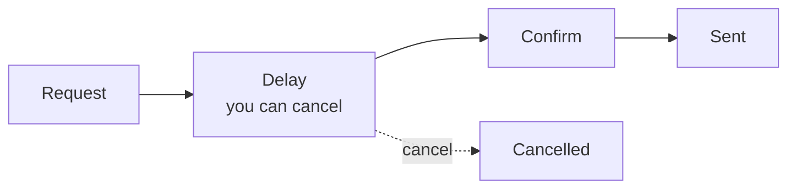

# Avelock

### A self-custody wallet where every withdrawal waits.

**Nobody can rush it** — not a thief with your recovery phrase, not someone forcing you, not us.

---

## Why a delay

Most wallets move money the moment a key signs. If the key leaks, or someone forces you to sign, the money is gone in seconds.

Avelock puts a **withdrawal delay** between the signature and the money leaving. During that time you see the request and can **cancel it** — from your phone, or from a second device that can only cancel and lock.

## What protects your funds

| | |
|---|---|
| **Withdrawal delay** | Every withdrawal waits. The contract enforces it — the app cannot skip it. |
| **Allowed addresses** | Money goes only to addresses you added, and a new address itself has to wait. |
| **Settings delay** | Weakening your protection waits too, so a thief cannot shorten the delay first. |
| **Permanent minimums** | Floors written at creation that no one can lower later. |
| **Panic Lock** | One tap voids every pending withdrawal and freezes the vault. |
| **Guard keys** | A second phone that can only cancel and lock — never send. |
| **Emergency PIN** | Opens the same wallet under pressure, with the same delays in force. |

## Networks

| Network | How the delay is enforced |
|---|---|
| Ethereum · Base · Arbitrum · Optimism · Polygon · BNB Chain · Avalanche | Vault smart contract |
| Tron | Vault smart contract |
| TON | Wallet contract with a permanent security module |
| Solana | On-chain program |
| Bitcoin · Litecoin | Taproot vault with co-signers (2-of-3) |

One recovery phrase covers all of them. Keys never leave your phone.

## Status

> [!IMPORTANT]
> Avelock is a **prototype on test networks**. It has not had an independent security audit yet. Do not use it with real funds.

- Personal vaults are created from the app on testnets (Sepolia, Base Sepolia, Nile, TON testnet, Solana devnet, Signet).
- Contract and app test suites run on every change; a public release comes after an external audit.

## Contact

- **Website** — [avelock.app](https://avelock.app)
- **Email** — [gleb@avelock.app](mailto:gleb@avelock.app)
- **Telegram** — [@hokvo](https://t.me/hokvo)

Found a security issue? Please write by email first, before sharing it publicly.

## Open source

Avelock is **open source** under the **GNU General Public License v3.0**. Anyone can read, audit, run and modify the code — including the contracts, the app and the co-signer — and verify that the deployed contracts match it. Modified versions that are shared must stay open under the same license.

The code is being prepared for publication and will appear here soon.

Built so that no one — including us — can hurry your money out.

